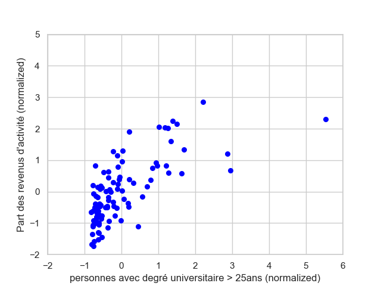

## Analyzing French socioeconomic data (income and education) using INSEE data

In this project, I analyze a dataset of socioeconomic indicators such as education and income
in France in the year 2013/2014 and perform a principal component analysis (PCA), and clustering, 
in order to retrieve information on the data.  

#### I. The dataset

I use two datasets taken from the French INSEE (Institute of statistics), 
the first one on income and poverty, 'Revenus et pauvreté des ménages en 2013' (https://www.insee.fr/fr/statistiques/2388572), 
and the second one on education, 'Population des 16 ans ou plus selon le niveau de diplôme, le sexe et l'âge de 1968 à 2014'
(https://www.insee.fr/fr/statistiques/1893149). Since for the second file, the year 2013 was not available, I chose the year 2014.
I use the data ordered by French département (corresponding sheet in the excel files).

The first dataset consists of 28 columns, containing information such as percentage of poverty among the total population, 
median living standard, percentage of work revenues, ratio of the 9th to the 1st percentile in terms of living standard, 
etc. From the second dataset related to education, I only retrieved columns corresponding to 'University degree' vs 'no degree'.

#### II. A first glance at the data - looking for correlations

The columns from the 'education file', concatenated with those from the 'income file', form 
a matrix containing 28 columns and 96 rows (départements from metropolitan France). Since the values in the different columns have different orders of magnitude, it makes sense to normalize the data for an easier comparison. 
For each column X, I calculate  <!--- (X-E[X]/sigma(X)) --> 

%3D%5Cfrac%7BX-E[X]%7D%7Bsigma(X)%7D,) 

where E and sigma denote the mean and the standard deviation of the column data (over the 96 départements), respectively.    

The pictures below show some selected scatter plots of different features (columns). Some of them show certain tendencies of clustering or even
strong linear correlation, such as (Image 2) for the percentage of taxed households and the median living standard.  

 

 

 

#### III. Principal Component Analysis (PCA) 

The principal component analysis aims at reducing the dimensionality of the data 
and at determining which features (columns) contribute most, and which ones contribute
the least, to the data. Through a singular value decomposition technique of the original 
matrix of data, the principal component vectors (PCA, singular vectors) are extracted. 
They indicate, by descending order (first PCA, second PCA etc..), the relative importance 
of the variance of the data along their direction, and their coordinates show which columns 
(features) are important and most contribute to changes in the data.    

In our case, the explained variance ratio is given by [0.49, 0.25, 0.12], 
which means that the first PCA vector explains nearly half of the variance of the (normalized)
data, the second PCA vector a quarter of the variance while the third PCA vector contributes 
in a negligible way to the variance. The orthogonal projection of the data onto the (hyper-)planes defined 
by the PCA vectors can be interpreted as a measure for 'socioeconomic strength'. In general, this projection
enables to detect patterns of the data such as clusters. 

In the table below are listed the first PCA vector (ie the coefficients of the feature columns), 
and the features corresponding to its coordinates. It turns out that all features contribute 
in a non negligible way to the data. The features that have the highest impact on, 
and contribute the most to the data, are of the order of 0.2 (in absolute value) and are indicated 
in bold: Hence, if the whole set of data constitutes an index of the socioeconomic strength, 
then the median living standard (column 4) and the percentage of households (col. 5)
that undergo taxes are the most contributing indicators to socioeconomic wealth, 
while the social payments (col. 22) followed by the poverty percentage of people younger than 30 years (col. 7), of landlords (col. 13) and of renting people 
(col. 14), contribute most to the decrease of socioeconomic wealth. 

------
| | features (columns) | First PCA vector   |
|-----| --- |-----   | 
|0| personnes sans diplôme > 25ans             |0.07923036756588557  |
|1|personnes avec degré universitaire > 25ans |0.14669470785940367 |
|2|Nombre de ménages fiscaux                  |0.12907604996167632|
|3|Nombre de personnes dans les ménages fiscaux |0.12679484638594274
|4|**Médiane du niveau vie**                      |**0.25084215040154817**
|5|**Part des ménages fiscaux imposés**           |**0.2393999100155044**
|6|Taux de pauvreté-Ensemble                  |-0.21821942383364293
|7|**Taux de pauvreté-moins de 30 ans**           |**-0.23263736576978833**
|8|Taux de pauvreté-30 à 39 ans               | -0.22861362700206347
|9|Taux de pauvreté-40 à 49 ans               |-0.2286513460211522
|10|Taux de pauvreté-50 à 59 ans               |-0.2074445294673355
|11|Taux de pauvreté-60 à 74 ans               |-0.14981848883719126
|12|Taux de pauvreté-75 ans ou plus            |-0.19132011163865156
|13|**Taux de pauvreté-propriétaires**             | **-0.23427519118088092**
|14|**Taux de pauvreté-locataires**                |**-0.2362220637905734**
|15|Part des revenus d'activité                |0.1912946586543183
|16|dont part des salaires, traitements ou chômage| 0.1907961816129444
|17|dont part des revenus d'activités non salariées| -0.10633046018610681
|18|Part des pensions, retraites et rentes         |-0.1729571404102694
|19|Part des revenus du patrimoine et autres revenus |0.061838650412534106
|20|Part de l'ensemble des prestations sociales    | -0.21688615585854673
|21|dont part des prestations familiales        |-0.08119298364119638
|22|**dont part des minima sociaux**                |**-0.24329884604227972**
|23|dont part des prestations logement          |-0.22024368213253356
|24|Part des impôts                             |-0.17745135858372782
|25|Rapport inter-décile 9e décile/1er decile   |0.08220318220286592
|26|1er décile du niveau de vie                 |0.2060121642714736
|27|9e décile du niveau de vie                  |0.20028997695711329
---

The figure below shows the 3D graph of the first three PCA components, and their projection 
onto the surfaces built by the (first three) PCA vector directions.  

 

<!----  --->

<!----  --->

<!----  --->

 

#### IV. Geographic distribution of a socioeconomic strength index and Clustering

1) The figure below shows the geographic distribution of a socioeconomic strength 
index that we define as being the projection of the data onto the first PCA vector.

This graph clearly shows the regions of socioeconomic wealth in France (especially Paris and the 
Western part of Île de France region, the Alps and the region close to Geneva, and to a weaker 
extent the Toulouse region (thanks to Airbus?), Southwest France (Biarritz, Bordeaux), Loire 
Atlantique and Ille et Vilaine, as well as the border to Germany, Bas- and Haut Rhin) in darker 
red color, as opposed to other regions in France that are poorer.      

2) Applying a hierarchical clustering (with the arbitrary choice of 3 clusters) on the 
orthogonal projection of the data set onto the first three PCA vectors 
-the matrix on which the clustering is performed is a 2D array of dimension
(number of features , number of PCA vectors)-  leads to the following graph.  

 

3) Performing this clustering (using 3 classes) reveals the 'poorest' -according to the above mentioned
 socioeconomic indicator- areas (dark color) in France, as opposed to the 'richest' regions (medium color intensity).
 The large majority of departments cam be classified according to an intermediate socioeconomic strength (intermediate 
 color intensity).  

